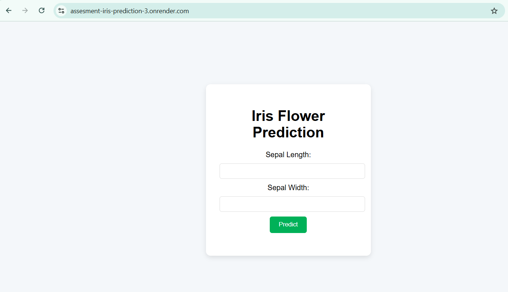
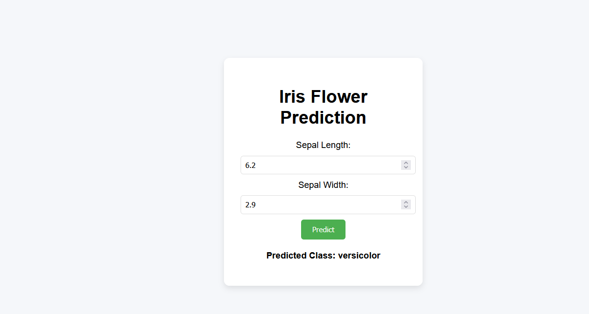

# Iris Flower Classification Web App 🌸

This project is a simple Flask application that predicts the species of an iris flower based on sepal length and width.

## 🚀 How to Run

1. Clone this repo or copy the files.
2. Create a virtual environment and install Flask + scikit-learn:

## UI




```bash
pip install flask scikit-learn


